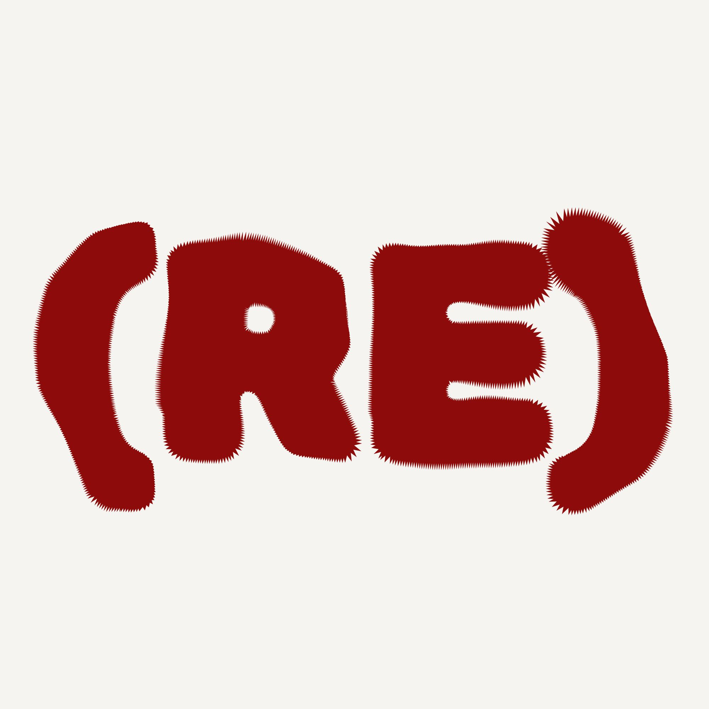

# RECRUITER

<p align="center">
  
</p>

<p align="center">
  <strong>Modern Recruitment Intelligence Platform</strong>
</p>

<p align="center">
  Track companies, opportunities, hiring pipelines, and recruitment analytics from one centralized workspace.
</p>

<p align="center">
  <a href="#overview">
    
  </a>
  <a href="#features">
    
  </a>
  <a href="#roadmap">
    
  </a>
  <a href="CONTRIBUTING.md">
    
  </a>
  <a href="SECURITY.md">
    
  </a>
</p>

<p align="center">
  
  
  
</p>

<hr>

## Overview

RECRUITER is a modern recruitment intelligence and company tracking platform designed to provide a structured workspace for managing recruitment-related information.

The platform brings company research, recruitment opportunities, hiring pipelines, and analytics into a single interface. Instead of maintaining information across multiple spreadsheets, bookmarks, notes, and different platforms, RECRUITER aims to provide a centralized environment for organizing and understanding recruitment activity.

The project is currently in its initial development stage. The present version focuses on establishing the core user interface, recruitment workflow, company intelligence structure, and analytics foundation. More advanced capabilities will be introduced progressively as the project develops.

<hr>

## Project Statement

Recruitment research can involve a significant amount of scattered information.

Companies publish opportunities across different platforms, recruitment stages change over time, and important information can easily become difficult to organize and track.

RECRUITER is designed around a simple idea:

> Bring recruitment information together, structure it clearly, and make it easier to understand.

The project aims to provide a practical and extensible foundation that can eventually evolve into a comprehensive recruitment intelligence platform.

<hr>

## Features

### Company Intelligence

Maintain structured information about companies and their recruitment activity.

- Company names
- Company websites
- Locations
- Industries
- Hiring information
- Available roles
- Recruiter information
- Recruitment status
- Additional notes

### Opportunity Tracking

Organize recruitment opportunities in a centralized workspace.

- Job opportunities
- Internships
- Graduate programs
- Placement opportunities
- Hiring drives
- Technical roles
- Opportunity status

### Recruitment Pipeline

Monitor opportunities through different stages of the recruitment process.

```text
Discovered
    ↓
Researching
    ↓
Applied
    ↓
Assessment
    ↓
Interview
    ↓
Selected / Rejected

```

---

<p align="center">
  
  <br>
  <strong>RECRUITER</strong>
</p>

<p align="center">
  <i>“Recruitment intelligence, organized.”</i>
</p>

<p align="center">
  <a href="CONTRIBUTING.md"></a>
  <a href="SECURITY.md"></a>
  <a href="#roadmap"></a>
</p>

<p align="center">
  <sub>© 2026 RECRUITER · Built for smarter recruitment.</sub>
</p>

---


<p align="center">
  <sub>
    © 2026 RECRUITER · Built for smarter recruitment research and opportunity management.
  </sub>
</p>
